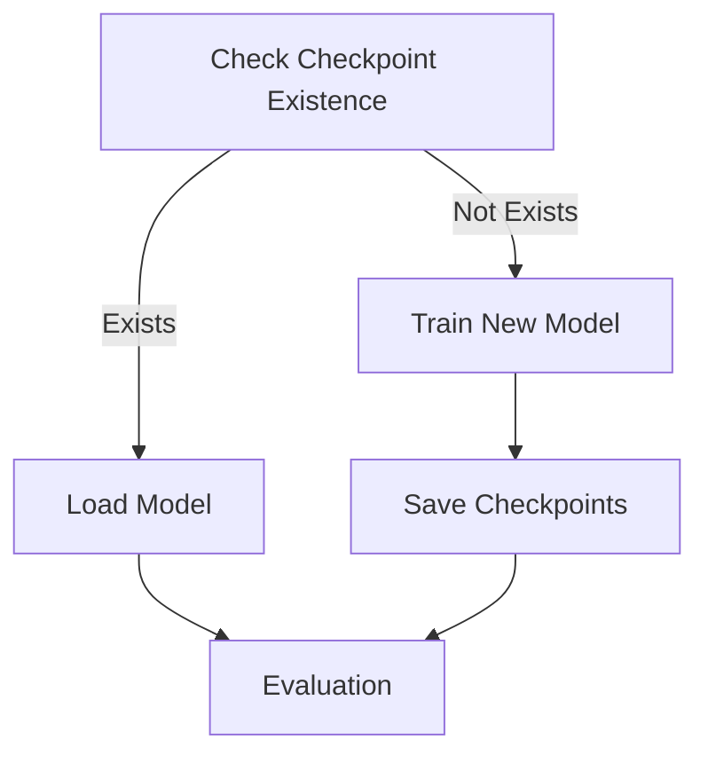

#  Doubly Disentangled Intrusion Detection
=======
# DIDS-MFL

A disentangled intrusion detection method to handle various intrusion detection scenarios, e.g. known attacks, unknown attacks, and few-shot attacks.


This repository contains the implementation of a sophisticated intrusion detection system (IDS) tailored for the Internet of Things (IoT) environment, which we called DIDS-MFL. DIDS-MFS has two critical components: DIDS and MFS. DIDS is a novel method that aims to tackle the performance inconsistent issues through two-step feature disentanglements and a dynamic graph diffusion scheme, and MFS is a plug-and-play module few-shot intrusion detection module by multi-scale information fusion. Equipped with DIDS-MFL, the administrators can effectively identify various attacks in encrypted traffic, including known, unknown ones, and the few-shot threats that are not easily detected. **To the best of our knowledge, DIDS-MFL takes the first step to achieve dynamic intrusion  detection in various scenarios.**


## Key Features

- **Dynamic Graph Diffusion**: Employs a dynamic graph diffusion scheme for spatial-temporal aggregation in evolving data streams.
- **Feature Disentanglement**: Utilizes a two-step feature disentanglement process to address the issue of entangled distributions of flow features.
- **Few-Shot Learning Module**: Integrates a few-shot learning approach for effective detection of novel intrusion types with limited instance data.
- **Memory Model**: Incorporates a memory model to generate representations that highlight attack-specific features.
- **Real-Time Detection**: Capable of performing real-time anomaly detection with high accuracy and speed.

## Getting Started

### Prerequisites

- numpy>=1.18.5
- pandas>=1.0.5
- scikit-learn>=0.23.1
- tqdm>=4.46.1
- torch>=1.6.0
- torch-geometric>=2.4.0
- scipy>=1.4.1
- z3-solver==4.12.2.0

### Installation

Clone the repository and install dependencies:

```bash
pip install -r requirements.txt
```

For the `torch-geometric` library, download additional dependencies from [PyG Wheels](https://data.pyg.org/whl/). Install a specific version using:

```bash
pip install torch_geometric==2.0.4 -i https://pypi.doubanio.com/simple
pip install torch_sparse
pip install torch_scatter==2.1.2
pip install matplotlib
```

**For GPU Support**:

```bash
pip install -r requirements.txt
pip install matplotlib
# Install CUDA-compatible PyTorch version
pip install torch_geometric==2.0.4 -i https://pypi.doubanio.com/simple
# Replace ${TORCH} and ${CUDA} with your versions (e.g., torch-1.10.0+cu113)
pip install torch-scatter -f https://pytorch-geometric.com/whl/torch-${TORCH}+${CUDA}.html
pip install torch-sparse -f https://pytorch-geometric.com/whl/torch-${TORCH}+${CUDA}.html
```

### Usage

Train and evaluate the model by running:

```bash
python main.py
```

This command initiates the training process, including pre-training, meta-training, and meta-testing phases.

### Base Models

| Model Name            | Role/Function                                                                                 |
|-----------------------|----------------------------------------------------------------------------------------------|
| TGNMemory             | Manages the temporal dynamics and memory state of nodes in the graph.                         |
| MGD (Multi-Graph Diffusion) | Allows information propagation across different graph structures.                          |
| MLPPredictor          | A multilayer perceptron for binary and multiple class predictions.                             |
| SelfExpr              | Enhances learning capabilities through self-expression mechanisms.                             |
| Loss Function         | Custom function designed to optimize model performance for the specific task.                 |


### Training Details

| Aspect                | Description                                                                                   |
|-----------------------|-----------------------------------------------------------------------------------------------|
| Data Preparation      | The dataset is preprocessed and filtered to ensure the inclusion of the required number of classes. |
| Model Architecture    | Utilizes `TGNMemory` for node memory state and `MGD` for updating node representations.         |
| Model Parameters      | Epsilon:0.3, Beta:1, gamma:0.1, Eta=0.1, alpha=0.1    |
| Optimizer             | Adam optimizer is used with a learning rate of 0.0001.                                         |
| Loss Function         | Custom loss function combining binary and multiple output losses.                              |
| Evaluation Metrics    | F1 Score, Normalized Mutual Information (NMI), Precision, and Recall are used for evaluation.   |
| Training Procedure    | Training is monitored with a tqdm progress bar and iterated until convergence.                 |


## Datasets

### Benchmark Datasets

The system is evaluated on the following datasets:

- CIC-ToN-IoT: A dataset designed for evaluating network-based intrusion detection systems in the context of IoT networks.
- CIC-BoT-IoT: Another IoT-focused dataset that simulates botnet attacks in a network environment.
- EdgeIIoT: A dataset collected from real-world IoT devices and networks, focusing on edge computing scenarios.
- NF-UNSW-NB15-v2: A network flow dataset containing modern normal and attack traffic traces from a university network.
- NF-CSE-CIC-IDS2018-v2: A dataset that combines network flows and system logs to provide a comprehensive view of network traffic.


To use a dataset, modify `main.py`:

```python
# file_name ='CIC-BoT-IoT' #0.8611 0.8536228104922525 论文：96.64 91.27
file_name ='CIC-ToN-IoT' #0.9867 0.9692784397676699 论文：97.47 94.27
# file_name = 'DNN-EdgeIIoT-dataset' #0.9599 0.9198900142036295 论文：92.73 88.21
# file_name ='NF-UNSW-NB15-v2_3d' # 0.9600 0.9204684780706881 论文：97.39 94.32
# file_name ='NF-CSE-CIC-IDS2018-v2_3d' #0.9600 0.9204684780706881 论文：93.93 90.98

data_all = torch.load('./data/'+file_name+'.pt', weights_only=False)
```
select the dataset you want to use.

The provided datasets are pre-processed. Large preprocessed .pt files(CIC-BoT-IoT.pt/NF-CSE-CIC-IDS2018-v2_3d ) are available in GitHub Releases. Smaller datasets can be found directly in the data/ directory.
If you want to download the original dataset, you can download above datasets used in this paper from the following URLs: [Kaggle Edge-IIoT Dataset](https://www.kaggle.com/datasets/sibasispradhan/edge-iiotset-dataset/data) and [UQ NIDS Datasets](https://staff.itee.uq.edu.au/marius/NIDS_datasets/). Then, select one of the three datasets.py files under the data directory to process the corresponding dataset.

Process CIC/EdgeIIoT/NF datasets using:

```bash
python datasets_CIC.py
```
```bash
python dataset_EdgeIIoT.py
```
```bash
python dataset_NF.py
```

size of dataset:

CIC-BoT-IoT.pt 238 MB
CIC-ToN-IoT.pt 97.9 MB 
DNN-EdgeIIoT-dataset.pt 27.6 MB 
NF-CSE-CIC-IDS2018-v2_3d.pt 204 MB
NF-UNSW-NB15-v2_3d.pt 31.2 MB

### Custom Data

To use custom data, ensure your dataset includes the following columns:

```python
column_info = TemporalData(  
    src=src,  
    dst=dst,  
    src_layer=src_layer,  
    dst_layer=dst_layer,  
    t=t,  
    dt=dt,  
    msg=msg,  
    label=label,  
    attack=attack  
)
```

## Performance Metrics

- **F1 Score**
- **Normalized Mutual Information (NMI)**

## Performance Comparison

| Dataset                     | F1 Score | NMI    | Steady F1  | Steady NMI | Paper Result (F1) | Paper Result (NMI) |
|-----------------------------|----------|--------|------------|------------|-------------------|--------------------|
| CIC-BoT-IoT                 | 0.8611   | 0.8536 | 0.8492     | 0.7935     | 0.9664            | 0.9127             |
| CIC-ToN-IoT                 | 0.9867   | 0.9692 | 0.9867     | 0.9692     | 0.9747            | 0.9427             |
| DNN-EdgeIIoT                | 0.9733   | 0.9391 | 0.9599     | 0.9198     | 0.9273            | 0.8821             |
| NF-UNSW-NB15-v2_3d          | 0.9600   | 0.9204 | 0.9442     | 0.9011     | 0.9739            | 0.9432             |
| NF-CSE-CIC-IDS2018-v2_3d    | 0.9600   | 0.9205 | 0.9600     | 0.9204     | 0.9393            | 0.9098             |


---

## Model Checkpoint Management

### 1. Automatic Checkpoint Creation
when checkpoints don't exist, the system automatically initiates training mode and saves two snapshots:
  - `best.pth`: Stores parameters achieving the highest validation F1 score
  - `last.pth`: Captures model state after each training epoch
these snapshots are automatically saved in the `checkpoints/{dataset_name}/` directory, where {dataset_name} is the name of the dataset being used.
 ```bash
  checkpoints/
  └── CIC-BoT-IoT/  # Example dataset folder
      ├── best.pth
      └── last.pth
  ```

 

### 2. Automatic Checkpoint Loading
when checkpoints exist, the system defaults to loading the best-performing model for evaluation,and do not perform training.
The default path is `./checkpoints/{dataset_name}/best.pth`, where {dataset_name} is the name of the dataset being used. To load a different model, modify the path accordingly. For example, to load the last checkpoint, change the suffix from `best.pth` to `last.pth`.

```python
    if os.path.exists('./checkpoints/'+file_name+'/best.pth'):
        checkpoint = torch.load('./checkpoints/'+file_name+'/best.pth',map_location=device)

        mgd.load_state_dict(checkpoint['mgd_state_dict'])
        semodel.load_state_dict(checkpoint['semodel_state_dict'])
        optimizer1.load_state_dict(checkpoint['optimizer_state_dict'])
        print("Loaded checkpoint from best.pth")

```

### Operational Workflow Diagram



## Baselines 

we select 11 few-shot learning models to incorporate into 3D-IDS as few-shot intrusion detection baselines, including 3 meta-learning based models (i.e., MBase, MTL, TEG), where TEG is designed for graph-structure-based few-shotlearning, 4 augmentation-based models (i.e., CLSA,
ESPT, ICI, KSCL], where CLSA and ESPT are based on contrastive augmentation, ICI and KSCL are based on instance augmentation), 4 metric learning-based models (i.e., BSNet, CMFSL, TAD, PCWPK).


### Baseline Models for 3D-IDS

This project incorporates a series of baseline models for few-shot learning in the context of 3D Intrusion Detection Systems (3D-IDS). Below is a brief description of each model type:

#### Meta-Learning Models
- **MBase**: A fundamental meta-learning model that serves as a basic benchmark for comparison.
- **MTL**: A Multi-Task Learning approach that enhances learning efficiency by leveraging shared features across multiple tasks.
- **TEG**: Tailored for graph-structured data, this model utilizes graph embedding techniques for few-shot learning scenarios.

#### Augmentation-Based Models
- **CLSA**: Employs contrastive augmentation to enhance the model's ability to distinguish between samples.
- **ESPT**: Builds upon contrastive augmentation with different strategies for further performance optimization.
- **ICI**: Utilizes instance augmentation to increase sample diversity and improve model generalization.
- **KSCL**: Another instance augmentation-based model, with unique strategies for few-shot learning.

#### Metric Learning-Based Models
- **BSNet**: Focuses on learning sample distances to bring similar samples closer and dissimilar ones further apart in feature space.
- **CMFSL**: A specialized metric learning model that include innovative feature extraction or similarity measurement techniques.
- **TAD**: Involves adaptive distance learning to better fit the few-shot learning context.
- **PCWPK**: Based on pairwise or contrastive learning approaches to improve accuracy in few-shot scenarios.

#### How to Test Baseline Models
To test any of the baseline models, you can run the following command in your terminal, replacing the method name accordingly:
```bash
python [Method].py
```
For example, to test the ICI model, you would use:
```bash
python ICI.py
```

## Updates

- **datasets process**: Fixed `OverflowError: mktime argument out of range` by restricting timestamps to start from January 2, 1970.
- **Baseline Models**: Added `.cpu()` to convert variables to CPU versions.
- **Main Program**:
  - Added checks for `data.num_nodes + data1.num_nodes`: `if data.src is None or len(data.src) == 0`.
  - Integrated `checkpoint` functionality.
  - Added t-SNE and heatmap visualization modules.
- **Epoch Adjustments**:
  - CIC-ToN: Pre-training epochs = 150, formal training epochs = 100.
  - NF-UNSW-NB15-v2_3d: Epochs = 50.
- **Checkpoint Loading**: Running `main.py` resumes training from checkpoints if available.
- **Heatmap**:
we can visualize the heatmap of the feature embedding.
- **t-SNE Parameters**:
```python
 
    tsne = TSNE(n_components=2, perplexity=20,early_exaggeration=12, random_state=42, init='random', learning_rate=1000.0)
# n_components:降维后的维度,默认2维
# perplexity:预估每个cluster可能有多少个元素
# early_exaggeration:初始放大倍数，增强类间分离

    tsne_results = tsne.fit_transform(out_embedding)
```
This code resides in meta_test for parameter tuning and t-SNE visualization.
The most critical parameter is perplexity, which estimates the number of elements per cluster. Verified settings for specific datasets are:
  - BoT/ToN/DNN-EdgeIIoT/NF-UNSW-NB15-v2_3d: perplexity=20
  - NF-CSE-CIC-IDS2018-v2_3d: perplexity=10

